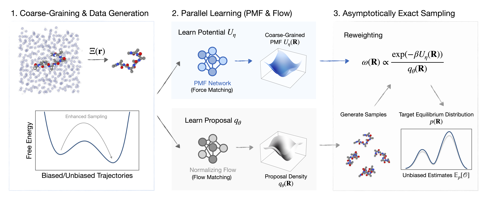

<div align="center">

# Coarse-Grained Boltzmann Generators

<a href="https://tummfm.github.io/cg-bg/"></a>
<a href="https://arxiv.org/abs/2602.10637"></a>
<a href="https://opensource.org/licenses/MIT"></a>

<p align="center">
  <em>Boltzmann Generators for asymptotically exact equilibrium sampling in coarse-grained representations, powered by JAX.</em>
</p>

---
</div>

## Overview

This repository implements Coarse-Grained Boltzmann Generators (CG-BGs) in JAX.
The codebase uses Hydra for configuration and experiment launching, Pixi for
reproducible environments, and Rich for terminal progress and status displays.

## Abstract

Sampling equilibrium molecular configurations from the Boltzmann distribution is a longstanding challenge. Boltzmann Generators (BGs) address this by combining exact-likelihood generative models with importance sampling, but practical scalability is limited. Meanwhile, coarse-grained surrogates enable the modeling of larger systems by reducing effective dimensionality, yet often lack a reweighting procedure required to ensure asymptotically correct statistics. In this work, we propose Coarse-Grained Boltzmann Generators (CG-BGs), a framework for reduced-order generative modeling with importance sampling in coarse-grained coordinate space. CG-BGs generate samples using a flow-based model and reweight them using a learned potential of mean force (PMF). We show that the PMF can be learned from rapidly converged trajectories via enhanced sampling force matching. Experiments demonstrate that CG-BGs capture solvent-mediated interactions in highly reduced representations while substantially reducing computational cost relative to atomistic BGs, providing a practical route toward equilibrium sampling of larger molecular systems.



## Install

This project uses Pixi for package management.

```bash
pixi install --frozen
```

## Quick Start

Preconfigured Hydra experiments are available via Pixi tasks:

- mb_ub
- mb_b
- ala2_cb_b
- ala2_cb_ub
- ala2_ha_b
- ala2_ha_ub
- ala3_cb_ub
- ala3_ha_ub
- ala6_cb_ub

Run an experiment:

```bash
pixi run <task_name>
```

## Hydra Overrides

All configuration is managed by Hydra. You can override any config value from
the CLI.

Stages:
- 1: training
- 2: sampling
- 3: energy + weights
- 4: plotting

Example:

```bash
pixi run <task_name> stage=234 hydra.run.dir=<output_dir>
```

## Environment Setup

Copy `.env.example` to `.env` and fill in your values:

```bash
cp .env.example .env
```

The minimum required setting is `SCRATCH_DIR` — the local directory where downloaded
data, pretrained weights, and outputs are cached. All other variables are optional for the default Hugging Face repository.

| Variable | Required | Description |
|---|---|---|
| `SCRATCH_DIR` | Yes | Local cache directory for data, pretrained weights, and outputs |
| `HF_TOKEN` | No | Only needed for private/gated HF repos or uploading files |
| `HF_REPO_ID` | No | Defaults to `bojuntum/CGPeptides` (public) |

## Data and Pretrained Weights from Hugging Face

All experiment configs download data and pretrained weights automatically from
[`bojuntum/CGPeptides`](https://huggingface.co/datasets/bojuntum/CGPeptides) on the
Hugging Face Hub. No manual download or token is needed — the files are fetched on
first run and cached under `$SCRATCH_DIR`.

To use a different Hugging Face repo, set `HF_REPO_ID` in `.env`:

```bash
HF_REPO_ID="your-username/your-dataset"
```

## Citation

If you use CG-BGs, please cite:

```bibtex
@article{chen2026cgbg,
  title={Coarse-Grained Boltzmann Generators},
  author={Chen, Weilong and Zhao, Bojun and Eckwert, Jan and Zavadlav, Julija},
  journal={arXiv preprint arXiv:2602.10637},
  year={2026}
}
```
